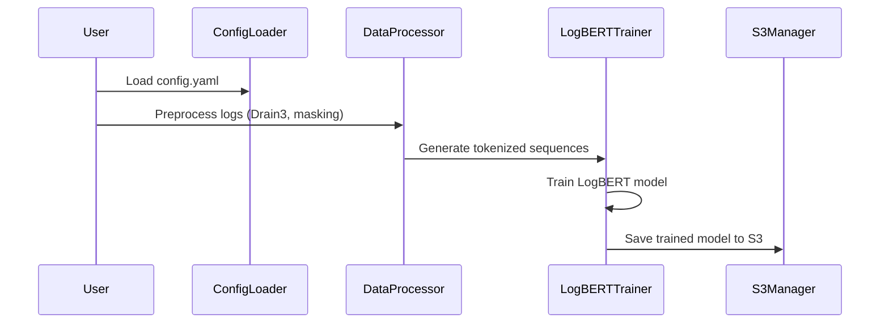
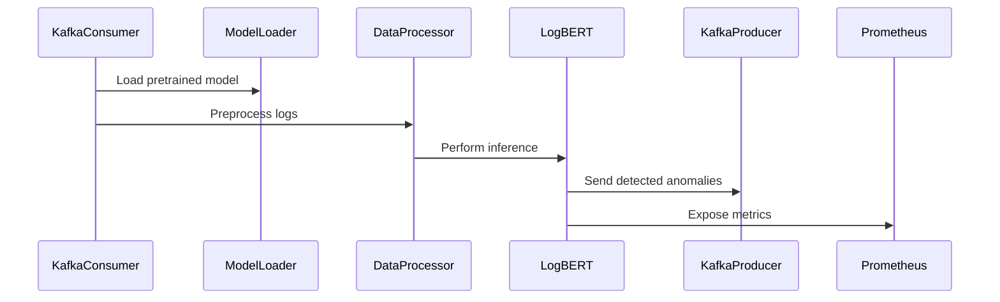
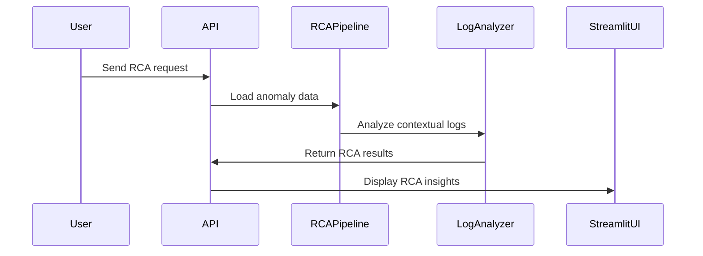

# 🚀 LogBERT Anomaly Detection Framework

A fully automated end-to-end platform for **log anomaly detection and root cause analysis** using LogBERT. It supports:

✅ **Training** via API  
✅ **Real-time inference** over Kafka streams  
✅ **RCA generation** via Hugging Face LLMs  
✅ **Streamlit dashboard** with live popups  
✅ **Prometheus + Grafana monitoring**  
✅ **S3 model artifact management**  

---

## 📐 System Architecture

```ascii
+-----------------+        +-----------------+         +-----------------+
|                 |        |                 |         |                 |
|  Log Producers  +------->+   Kafka Broker   +-------->+  Inference API  |
| (Apps, Systems) |        | (anomalies_topic)|         | (FastAPI)       |
+-----------------+        +-----------------+         +--------+--------+
                                                                 |
                                                                 v
                                                       +-----------------+
                                                       |   Hugging Face  |
                                                       |   RCA LLM       |
                                                       +--------+--------+
                                                                |
                                                                v
                                                       +-----------------+
                                                       | Streamlit UI    |
                                                       | (Live RCA Popups|
                                                       +-----------------+

Prometheus scrapes metrics from:
- Training API
- Inference API
- Kafka Consumer lag

Below is the detailed flow

# 🔥 Detailed Flow Descriptions with Diagrams

Below section explains in depth the three main flows in the `logbert-anomaly-detection` project: **Training**, **Inference**, and **RCA Generation**. Each flow includes detailed step-by-step processes, involved files, and sequence diagrams.

---

## 🏋️‍♂️ Training Flow

### 📘 Overview
The Training Flow prepares the LogBERT model using historical log data by preprocessing, template mining, sequence generation, and model training.

### 📂 Involved Files
- `src/data/data_process.py`
- `src/training/train_pipeline.py`
- `src/model/logbert.py`
- `src/model/utils.py`
- `src/utils/config_loader.py`
- `src/utils/s3_manager.py`
- `config/config.yaml`

### 🛠️ Steps
1. **Load Configuration**: `config_loader.py` loads parameters from `config/config.yaml` (e.g., mask probability, sequence window size).
2. **Preprocess Logs**: `data_process.py` uses Drain3 for template mining and applies masking for UUIDs/IPs.
3. **Generate Sequences**: Tokenized sequences are created for feeding into LogBERT.
4. **Train Model**: `train_pipeline.py` calls LogBERT (`logbert.py`) for training with masked language modeling.
5. **Save Artifacts**: Trained model is stored locally or uploaded to S3 using `s3_manager.py`.

### 📊 Sequence Diagram


---

## ⚡ Inference Flow

### 📘 Overview
The Inference Flow uses the trained LogBERT model to detect anomalies in real-time streaming logs from Kafka.

### 📂 Involved Files
- `src/inference/kafka_infer_consumer.py`
- `src/inference/inference_pipeline.py`
- `src/inference/kafka_anomaly_producer.py`
- `src/utils/model_loader.py`
- `src/utils/metrics_util.py`
- `src/utils/config_loader.py`
- `model/logbert.py`
- `model/utils.py`
- `config/config.yaml`

### 🛠️ Steps
1. **Consume Logs**: `kafka_infer_consumer.py` listens to Kafka topics for new logs.
2. **Load Model**: `model_loader.py` fetches the pretrained LogBERT model from local or S3.
3. **Preprocess Logs**: `data_process.py` templates and tokenizes new logs.
4. **Run Inference**: `inference_pipeline.py` performs anomaly scoring using entropy calculation (`model/utils.py`).
5. **Publish Anomalies**: Detected anomalies are sent to Kafka using `kafka_anomaly_producer.py` and metrics are exposed via Prometheus using `metrics_util.py`.

### 📊 Sequence Diagram


---

## 🔍 RCA (Root Cause Analysis) Flow

### 📘 Overview
RCA Flow analyzes anomalies post-detection to identify probable root causes using contextual log information.

### 📂 Involved Files
- `src/rca/rca_pipeline.py`
- `src/api/main.py`
- `src/app/streamlit_ui.py`
- `src/utils/config_loader.py`
- `src/model/utils.py`
- `config/config.yaml`

### 🛠️ Steps
1. **API Request**: `main.py` exposes `/rca` endpoint for RCA queries.
2. **Load Anomalies**: `rca_pipeline.py` fetches anomaly sequences.
3. **Analyze Context**: Applies entropy-based analysis (`model/utils.py`) to surrounding logs.
4. **Serve Results**: RCA results served via API and visualized on `streamlit_ui.py` frontend.

### 📊 Sequence Diagram


---
